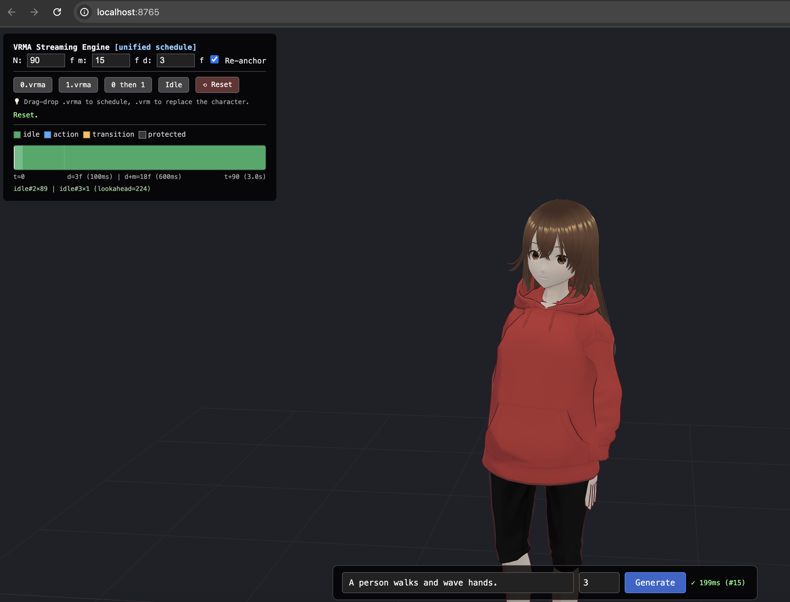

<!-- Language: 中文 | [English](README.md) -->

# SimpleText2Motion

> 实时文本到动作生成（Text-to-Motion）：输入一句英文描述，实时生成 VRMA 动画并驱动浏览器中的 VRM 角色。

[English README](README.md) · [许可协议](#许可协议) · [ModelScope 镜像](#模型下载)

<table>
<tr>
<td width="50%">
  
</td>
<td width="50%">

https://github.com/user-attachments/assets/31aa4018-7225-46eb-a469-6097b5e64802

</td>
</tr>
</table>

---

## 项目简介

SimpleText2Motion 是一套**轻量、跨平台、不依赖 Python 运行时**的实时文本到动作生成框架。
你输入一句类似 `"A person walks forward and waves their right hand."` 的英文描述，
系统实时生成对应的人体动作，并以 VRMA 格式驱动浏览器中的 VRM 角色播放。

整个推理链路由 C++ 实现，**运行时不需要任何 Python 环境**——
LLM 推理基于 [llama.cpp](https://github.com/ggml-org/llama.cpp)，
动作生成模型导出为 ONNX 由 ONNX Runtime 执行。这使得它可以编译为单一可执行程序，
方便在 Linux / macOS / Windows 上分发与部署。

### 模型部分

动作生成模型是一个轻量的 **条件 DiT + Flow Matching** 框架：

- **文本编码（Bi-Refiner）**：在冻结的 SimpleTool-4B 中间层 hidden state（维度 2560）之上，
  接 2 层双向自注意力做精炼，得到 token 级与全局（pooled）文本特征。
- **动作解码（DiT）**：8 层 Transformer，带 cross-attention 注入文本条件，
  使用 adaLN-Zero 注入 timestep / 文本 / 时长条件。
- **训练目标**：Conditional Flow Matching（速度场预测）。
- **输出**：`(T, 135)` 的 SMPL-H rot6d 表示（3 平移 + 6 根旋转 + 21×6 身体旋转），30 fps。

训练数据为约 **100 万条英文 text–motion 配对**，因此目前指令遵循能力以英文为主。

---

## 推理框架与数据流

推理框架本身是本项目的核心之一：**全 C++、跨平台、无 Python 依赖**，
各阶段以本地 TCP 端口解耦，便于二次开发与集成。

```
"A person walks forward and waves their right hand."
                     │
                     ▼
             ┌───────────────┐         ┌──────────────────┐
             │  fused_server │ ──────▶ │  SimpleTool-4B   │
             │   port 8421   │ hidden  │  via llama.cpp   │
             └───────┬───────┘         └──────────────────┘
                     │ (N, 2560) float32
                     ▼
             ┌───────────────┐         ┌──────────────────┐
             │   t2m_infer   │ ──────▶ │   birefiner +    │
             │   port 8423   │  ONNX   │  dit_step (ORT)  │
             └───────┬───────┘         └──────────────────┘
                     │ (T, 135) float32  (SMPL-H rot6d, 30 fps)
                     ▼
             motion.bin ─▶ motion_to_vrma ─▶ motion.vrma
```

每个阶段都封装为独立服务、通过固定本地端口通信：

- `fused_server`（:8421）—— 调用 llama.cpp 提取 SimpleTool-4B 的 hidden state。
- `t2m_infer`（:8423）—— ONNX Runtime 运行 birefiner + DiT，生成动作张量。
- `motion_to_vrma` —— 将动作张量转换为可播放的 VRMA。
- `run_server`（:8765）—— HTTP 服务，串联整条链路并把结果流式返回浏览器。

**端口已封装好，欢迎二次开发与集成**：你可以只接其中某一段（例如直接调用 `t2m_infer`
拿动作张量），也可以把整条链路嵌入自己的应用。

---

## 性能

3 秒动作片段的端到端延迟（`bench_t2m`）：

| 硬件                         | client_wall | hidden  | dit_total |
|------------------------------|------------:|--------:|----------:|
| H100（CUDA）                 |    15.7 ms  |  2.4 ms |   11.1 ms |
| Apple M4 Pro（Metal）        |    71.3 ms  | 21.5 ms |   48.2 ms |
| RTX 3060 + i5-12600KF（CUDA）|   117.5 ms  | 11.8 ms |  102.1 ms |

---

## 各平台后端说明

LLM 阶段（llama.cpp）始终使用 GPU 加速以保证速度；动作 DiT 模型很小，
ONNX 端是否用 GPU 对延迟影响有限。

| 平台    | llama.cpp 后端 | ONNX Runtime 后端 |
|---------|----------------|-------------------|
| Linux   | CUDA           | CPU 或 CUDA       |
| macOS   | Metal（自动）  | CPU               |
| Windows | CUDA           | **CPU**           |

> **Windows 说明**：Windows 版默认 **llama.cpp 走 CUDA、ONNX Runtime 走 CPU**。
> 这样既保留了 LLM 阶段的 GPU 加速，又避免引入庞大的 cuDNN / CUDA-ONNX 依赖；
> DiT 模型本身很小，CPU 推理仅增加几十毫秒，对实时场景完全够用。

---

## 安装

前置依赖：Git、CMake ≥ 3.18、C++17 编译器；GPU 版还需对应平台的 CUDA Toolkit。
macOS 需 `xcode-select --install`，Windows 需 Visual Studio 2022（含 C++ 桌面开发）。

### 1. Clone 与下载模型

```bash
git clone https://github.com/HaxxorCialtion/SimpleText2Motion.git
cd SimpleText2Motion

mkdir -p models/SimpleT2M
BASE=https://huggingface.co/Cialtion/SimpleLove/resolve/main
wget -q -P ./models           $BASE/SimpleTool-4B-trim6-q4.gguf &
wget -q -P ./models/SimpleT2M $BASE/SimpleT2M/birefiner.onnx &
wget -q -P ./models/SimpleT2M $BASE/SimpleT2M/config.json &
wget -q -P ./models/SimpleT2M $BASE/SimpleT2M/dit_step.onnx &
wget -q -P ./models/SimpleT2M $BASE/SimpleT2M/small_weights.bin &
wget -q -P ./models/SimpleT2M $BASE/SimpleT2M/small_weights.npz &
wait
```

### 2. 第三方依赖

```bash
mkdir -p third_party && cd third_party
git clone --depth 1 https://github.com/yhirose/cpp-httplib.git
git clone --depth 1 https://github.com/marzer/tomlplusplus.git
# git clone --depth 1 https://github.com/madler/zlib.git   # 仅 Windows 需要

# ONNX Runtime：选对应平台的包，并建软链接为 onnxruntime
# Linux : ORT_PKG=onnxruntime-linux-x64-1.20.1            （CPU，推荐）
# macOS : ORT_PKG=onnxruntime-osx-arm64-1.18.1
curl -L -O https://github.com/microsoft/onnxruntime/releases/download/v1.20.1/onnxruntime-linux-x64-1.20.1.tgz
tar -xzf onnxruntime-linux-x64-1.20.1.tgz && rm onnxruntime-linux-x64-1.20.1.tgz
ln -sfn onnxruntime-linux-x64-1.20.1 onnxruntime
cd ..
```

### 3. 编译

```bash
# llama.cpp（Linux 用 CUDA；macOS 去掉 GGML_CUDA，自动 Metal）
cd llama.cpp && rm -rf build
cmake -B build -DGGML_CUDA=ON -DCMAKE_CUDA_ARCHITECTURES=native -DBUILD_SHARED_LIBS=ON
cmake --build build --config Release -j

# fused_server（macOS 把 $ORIGIN 换成 @loader_path）
g++ -std=c++17 -O2 -I include -I ggml/include -I .. -I ../cpp \
    -I ../third_party/tomlplusplus/include -I ../third_party/onnxruntime/include \
    fused_server.cpp -L build/bin -lllama -lggml -lggml-base -lggml-cpu \
    -L ../third_party/onnxruntime/lib -lonnxruntime -lpthread \
    -Wl,-rpath,'$ORIGIN/build/bin' \
    -Wl,-rpath,'$ORIGIN/../third_party/onnxruntime/lib' -o fused_server
cd ..

# 其余模块
rm -rf build && cmake -B build && cmake --build build -j
```

> Windows 的完整 PowerShell 步骤见 **[英文 README](README.md)**（含 zlib、ONNX `.zip`
> 包名、以及 `fused_server` 由 CMake 一并编译等差异）。

### 4. 运行

```bash
bash ./scripts/start_servers.sh   # 终端 A：fused_server + t2m_infer
./build/run_server                # 终端 B：demo，浏览器打开 http://localhost:8765
```

---

## 模型下载

模型权重托管于 Hugging Face，国内可用 ModelScope 镜像。

- Hugging Face：`https://huggingface.co/Cialtion/SimpleLove`
- ModelScope（国内镜像）：`https://www.modelscope.cn/models/cialtion/SImpleLove`

需要下载的文件：`SimpleTool-4B-trim6-q4.gguf`，以及 `SimpleT2M/` 目录下的
`birefiner.onnx`、`dit_step.onnx`、`config.json`、`small_weights.bin`、`small_weights.npz`。

---

## 路线图

- [ ] 发布各平台**免编译发行版**（开箱即用，无需自行构建）。
- [ ] 提升 text-to-motion 的**指令遵循能力**（更复杂 / 组合 / 多动作描述）。

---

## 二次开发与集成

各阶段服务端口固定、协议简单，欢迎在此基础上做二次开发或集成进自己的项目。
若有问题或合作意向，欢迎提 Issue。

---

## 致谢

- [llama.cpp](https://github.com/ggml-org/llama.cpp) —— LLM 推理后端。
- 动作生成框架（Bi-Refiner + DiT + Flow Matching）为本项目自研的轻量化实现。

---

## 许可协议

本项目采用 **MIT License**，**完全允许商业使用**、修改与再分发。详见 [LICENSE](LICENSE)。

> 注：本仓库引用的 llama.cpp 等第三方组件各自遵循其原始许可协议。